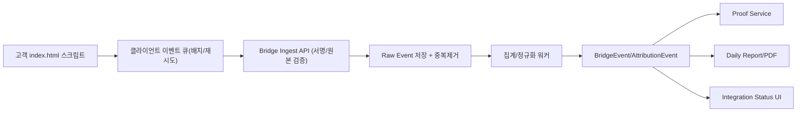

# GhostLink 고객 `index.html` 삽입 스크립트 고도화 매뉴얼 (백엔드 완전 연동)

작성일: 2026-02-10  
대상: Backend / Frontend / Data / DevOps

## 0) 가능 여부 (결론)

**가능합니다.**  
현재 구현(`GET /api/bridge/{script_id}.js` + `GET /api/bridge/{script_id}/event`)을 기반으로,  
고성능 이벤트 수집/보안/증명 지표/리포트까지 일관되게 연결하는 **최고 수준 고도화**가 가능합니다.

단, “완전 연동”을 위해서는 스크립트 단독 개선이 아니라 아래 4개 축을 함께 고도화해야 합니다.

1. 클라이언트 스크립트 런타임
2. 수집 API 및 인증 토큰 체계
3. 저장/집계 파이프라인
4. Proof/Attribution/Report 노출 계층

---

## 1) 현재 구조 요약 (기준선)

현재 코드 기준 핵심 동작:

1. 고객 페이지는 `index.html`에 아래 스크립트를 1회 삽입
   `https://{host}/api/bridge/{script_id}.js`
2. 브라우저에서 `pageview`, `engaged_15s`, `hidden`, `leave` 이벤트를 전송
3. 이벤트는 `BridgeEvent` 테이블로 저장
4. 봇/사람 방문은 `BotVisit` 및 `BridgeEvent`로 집계되어 리포트에 반영
5. 설치 감지는 7일 `script_request_count`, `bridge_event_count` 기준으로 판단

관련 파일:

1. `app/routers/bridge.py`
2. `app/models/analytics.py`
3. `app/services/report_service.py`
4. `app/routers/pages.py` (`/docs/integration-guide`)

---

## 2) 현재 한계 (고도화 필요 지점)

1. 이벤트 전송이 단건 GET 픽셀 중심이라 대량 트래픽에서 비효율
2. 스크립트 로드시 생성된 토큰 만료 시(기본 15분) 장기 세션 추적 약화
3. 클라이언트 재시도 큐/배치 전송/오프라인 복구가 제한적
4. 백엔드 저장이 실시간 단건 insert 중심이라 처리량 확장성 한계
5. 다중 인스턴스 환경에서 in-memory cache 일관성 보장 부족
6. `BridgeEvent`와 전환(`AttributionEvent`) 연결이 약해 “전환 기여도” 증명에 추가 보강 필요

---

## 3) 목표 아키텍처 (완전 연동 정의)

“완전 연동”의 정의:

1. 스크립트 이벤트가 유실 없이 서버로 전송
2. 서버는 중복 제거/검증/저장을 안정적으로 처리
3. 저장 데이터가 Attribution/Proof/Report까지 자동 연결
4. 운영자가 설치 상태/품질/전환 기여를 동일 데이터 체인으로 확인

### 3.1 데이터 흐름



---

## 4) 고도화 방법 (개발 절차)

## 4.1 클라이언트 스크립트 고도화

1. 전송 방식:
   `navigator.sendBeacon` 우선, 실패 시 `fetch(keepalive)`, 마지막 fallback은 image 픽셀
2. 배치 전송:
   이벤트를 메모리/스토리지 큐에 적재 후 `N개 또는 T초` 단위로 묶어 전송
3. 재시도:
   지수 백오프(예: 1s, 2s, 4s, 최대 30s), 최대 재시도 횟수 제한
4. 중복 방지:
   각 이벤트에 `event_id(ULID/UUID)` 부여, 같은 `event_id` 재전송 시 서버에서 dedupe
5. SPA 대응:
   `history.pushState`, `popstate`, 라우트 변경 감지로 가상 페이지뷰 수집
6. 성능 예산:
   초기 로드 블로킹 금지(비동기 IIFE), 총 스크립트 크기 예산 설정(예: gzip 12KB 내)
7. 프라이버시:
   DNT/CMP(동의) 미승인 시 이벤트 차단 또는 최소 수집 모드

## 4.2 백엔드 인제스트 API 고도화

1. 신규 배치 엔드포인트 추가:
   `POST /api/bridge/{script_id}/events`
2. 요청 본문:
   `{ "events": [...], "token": "...", "sent_at": "..." }`
3. 검증:
   script_id 유효성, 토큰 서명, 만료 시간, origin/referer, payload schema
4. 제한:
   script_id/IP 단위 rate limit, payload size 제한, 이벤트 개수 상한
5. 응답:
   `accepted`, `dropped`, `reasons`를 반환해 클라이언트 재시도 전략과 연동

## 4.3 저장/처리 파이프라인 고도화

1. Raw 이벤트 테이블 도입:
   유실 없는 원본 보관(`received_at`, `event_id`, `payload_json`, `status`)
2. 정규화 워커:
   Raw -> `BridgeEvent`/`AttributionEvent` 변환
3. 멱등성:
   `event_id` unique constraint + 처리 상태 플래그
4. 대량 처리:
   bulk insert / batch commit 적용
5. 장애 복구:
   실패 행 재처리 큐(dead-letter 또는 retry status)

## 4.4 Proof/Report/대시보드 완전 연동

1. BridgeEvent에서 세션/경로/engagement를 집계
2. Conversion 이벤트와 세션키로 결합해 `AI Assist Rate` 품질 강화
3. Daily Report에 증거 라벨(`measured/predicted`) 유지
4. Integration Guide에 설치 품질 지표 추가:
   수집 성공률, 이벤트 유실률, 토큰 검증 실패율

---

## 5) 제안 API 계약 (v2)

### 5.1 스크립트

1. `GET /api/bridge/{script_id}.js`
2. `GET /api/bridge/{script_id}/token` (선택: 장기 세션 토큰 갱신)

### 5.2 이벤트 인제스트

1. `POST /api/bridge/{script_id}/events` (배치, 권장)
2. `GET /api/bridge/{script_id}/event` (하위호환, 축소 유지)

### 5.3 응답 예시

```json
{
  "accepted": 48,
  "dropped": 2,
  "reasons": {
    "expired_token": 1,
    "invalid_origin": 1
  },
  "server_time": "2026-02-10T12:00:00Z"
}
```

---

## 6) 보안/규정 준수 기준

1. 토큰 TTL 단축 + 갱신 전략 병행 (짧은 만료, 안전한 재발급)
2. `BRIDGE_SIGNING_SECRET` 필수화(환경별 분리)
3. 데이터 최소 수집 원칙(PII 금지, URL/referrer 마스킹 정책)
4. 개인정보 요청 대응:
   session_id 기반 삭제/익명화 경로 정의
5. 로그 마스킹:
   raw payload 저장 시 민감 필드 제거

---

## 7) 성능 목표 (권장 SLO)

1. 인제스트 API p95 < 200ms
2. 이벤트 수집 성공률 >= 99.5%
3. 중복 이벤트 비율 < 1%
4. 리포트 집계 지연 < 5분

---

## 8) 단계별 구현 로드맵

### Phase 1 (1~2일): 안정화 기반

1. 이벤트 스키마 고정(`event_id`, `sent_at`, `session_id`, `event_type`)
2. POST 배치 인제스트 엔드포인트 추가
3. 하위호환 GET 이벤트 유지

### Phase 2 (2~4일): 신뢰성 고도화

1. 클라이언트 큐/배치/재시도/오프라인 복구
2. 서버 멱등성(dedupe) + rate limit
3. 구조화 로그 + 운영 메트릭 대시보드

### Phase 3 (3~5일): 완전 연동

1. Raw->정규화 워커 연결
2. Attribution 결합 강화(전환 이벤트 매핑)
3. Daily Report/Proof에 품질 KPI 추가 반영

---

## 9) 개발 전 체크리스트

1. 고객 도메인/서브도메인 허용 정책 확정
2. 이벤트 스키마 버전(`schema_version`) 확정
3. DNT/CMP 정책 확정(국가별 법규 반영)
4. 실패 재처리 정책 확정(최대 재시도/보관기간)
5. 운영 모니터링 알람 임계치 확정

---

## 10) 최종 인수 기준 (Done)

1. 고객 `index.html` 1회 삽입으로 SPA/MPA 모두 이벤트 정상 수집
2. 토큰 만료/네트워크 오류 상황에서 유실 최소화 재전송 동작
3. BridgeEvent, AttributionEvent, Report 수치가 데이터 체인으로 일관
4. Integration Guide에서 설치 감지 + 수집 품질 상태 확인 가능
5. 배포 후 7일간 오류율/유실률이 목표 SLO 내 유지

