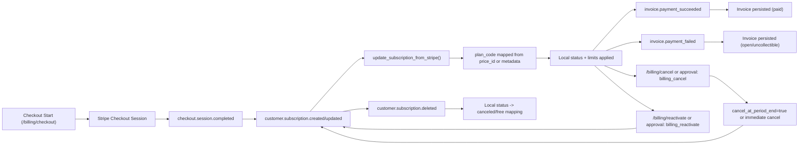

# Stripe Subscription State Transitions (GhostLink)

Updated: 2026-02-07

## Scope
- Documents how webhook events and billing actions update local subscription state.
- Source implementation:
  - `app/routers/webhooks.py`
  - `app/services/subscription_service.py`
  - `app/services/stripe_service.py`
  - `app/routers/billing.py`
  - `app/services/approval_service.py`

## State Model
- Local subscription tracks:
  - `plan_code`
  - `status` (`active`, `trialing`, `past_due`, `canceled`, etc.)
  - `stripe_subscription_id`, `stripe_customer_id`, `stripe_price_id`
  - cycle timestamps (`current_period_start`, `current_period_end`)
  - cancel/trial flags

## Event/Action Flow

## Invariants
- Webhook deduplication is persisted in DB (`ProcessedWebhookEvent`).
- `price_id -> plan_code` mapping must run on every Stripe sync.
- Unknown `price_id` falls back to metadata plan hints, then existing plan.
- `org_id` ownership is always validated before direct billing changes.

## Operational Checks
- `checkout.session.completed` eventually results in non-empty `stripe_subscription_id`.
- Active paid plan has non-`free` `plan_code`.
- `invoice.*` events create/update invoice records without runtime errors.
- Duplicate Stripe events do not create duplicate side effects.

## Failure Handling
- Signature verification failure: reject webhook (`400`).
- Unsupported event type: log and ignore.
- Missing org binding metadata: fallback search via local subscription/customer linkage when possible.
