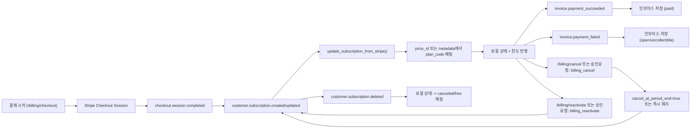

# Stripe 구독 상태 전이 (GhostLink)

업데이트: 2026-02-07

## 범위
- webhook 이벤트와 결제 액션이 로컬 구독 상태를 어떻게 변경하는지 문서화합니다.
- 구현 소스:
  - `app/routers/webhooks.py`
  - `app/services/subscription_service.py`
  - `app/services/stripe_service.py`
  - `app/routers/billing.py`
  - `app/services/approval_service.py`

## 상태 모델
- 로컬 구독은 아래를 추적합니다.
  - `plan_code`
  - `status` (`active`, `trialing`, `past_due`, `canceled` 등)
  - `stripe_subscription_id`, `stripe_customer_id`, `stripe_price_id`
  - 과금 주기 시각(`current_period_start`, `current_period_end`)
  - 취소/트라이얼 플래그

## 이벤트/액션 흐름

## 불변 조건
- webhook 중복 처리는 DB(`ProcessedWebhookEvent`)에 영속화합니다.
- `price_id -> plan_code` 매핑은 매 Stripe 동기화마다 실행되어야 합니다.
- 미확인 `price_id`는 metadata의 plan 힌트, 그 다음 기존 plan을 fallback으로 사용합니다.
- 직접 결제 변경 전에는 항상 `org_id` 소유권 검증이 수행됩니다.

## 운영 점검 항목
- `checkout.session.completed` 이후 `stripe_subscription_id`가 최종적으로 비어있지 않아야 합니다.
- 유료 활성 플랜은 `plan_code != free` 상태여야 합니다.
- `invoice.*` 이벤트는 런타임 오류 없이 인보이스 레코드를 생성/수정해야 합니다.
- 중복 Stripe 이벤트는 중복 부작용을 만들지 않아야 합니다.

## 장애 처리
- 시그니처 검증 실패: webhook 거부 (`400`)
- 지원하지 않는 이벤트 타입: 로그 기록 후 무시
- org 바인딩 metadata 누락: 가능하면 로컬 subscription/customer 연계로 fallback 탐색
